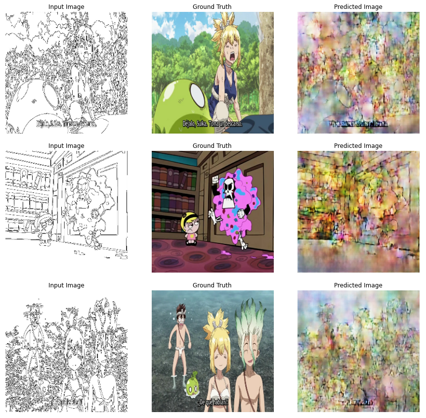

# pix2pixCSV - Primera prueba

## Pix2pix Draws

_Projecto basado en pix2pixHD_

  Este proyecto pretende generar una RNA capaz de generar un dibujo coloreado y bien definido en cuanto a lineas, unicamente con un boceto a blanco y negro del mismo.

  Por ahora los resultados son con un dataset de entrenamiento de 260 imagenes, 700 Epoch y con el datasetV1. 
  sin alterar los parametros del paper original.

    

## Autores ✒️

* **William A. Tovar R.** - *Desarrollador* - [williamtovar](https://github.com/williamtovar)

## Expresiones de Gratitud 🎁

* Muchas gracias a [tensorflow](https://github.com/tensorflow) por facilitar el paper y el colab original sobre el cual esta basado este proyecto.
 Dejo el enlace al documento en Colab por si quieren revisarlo - Link (https://colab.research.google.com/github/tensorflow/docs/blob/master/site/en/tutorials/generative/pix2pix.ipynb?authuser=3#scrollTo=Ds4o1h4WHz9U)
